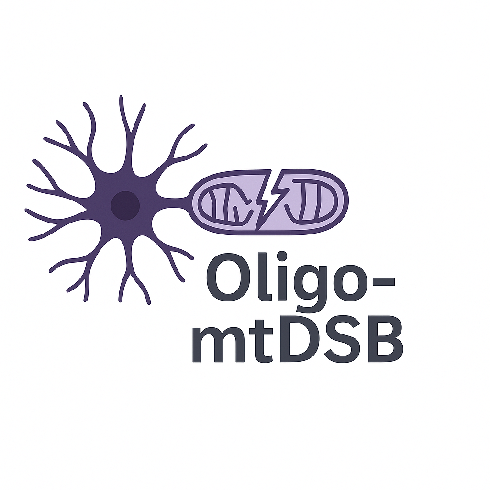

# oligo-mtDSB  

  

This project investigates the consequences of **double-stranded breaks (DSBs) in mitochondrial DNA (mtDNA) of oligodendrocytes** using a genetically engineered mouse model. Spatially resolved **Xenium transcriptomics** is applied to capture cellular and regional responses to mtDNA damage in the CNS.  

## Project Overview  
- **Model**: Mouse with induced mtDNA double-strand breaks in oligodendrocytes  
- **Focus**: Linking mitochondrial genome instability to oligodendrocyte dysfunction, demyelination, and lesion formation  
- **Data**: 10x Genomics Xenium (spatial transcriptomics)  
- **Goal**: Define how mtDNA integrity impacts oligodendrocyte biology and contributes to neuroinflammation and MS-like pathology  

## Repository Structure  
- `notebooks/` – analysis workflows (QC, clustering, differential expression, spatial mapping)  

## Analysis Highlights  
- Cell type–resolved effects of mtDNA DSBs  
- Spatial mapping and proximity-dependent transcriptomic changes  
- Pathway-level insights into mitochondrial stress and myelin integrity  