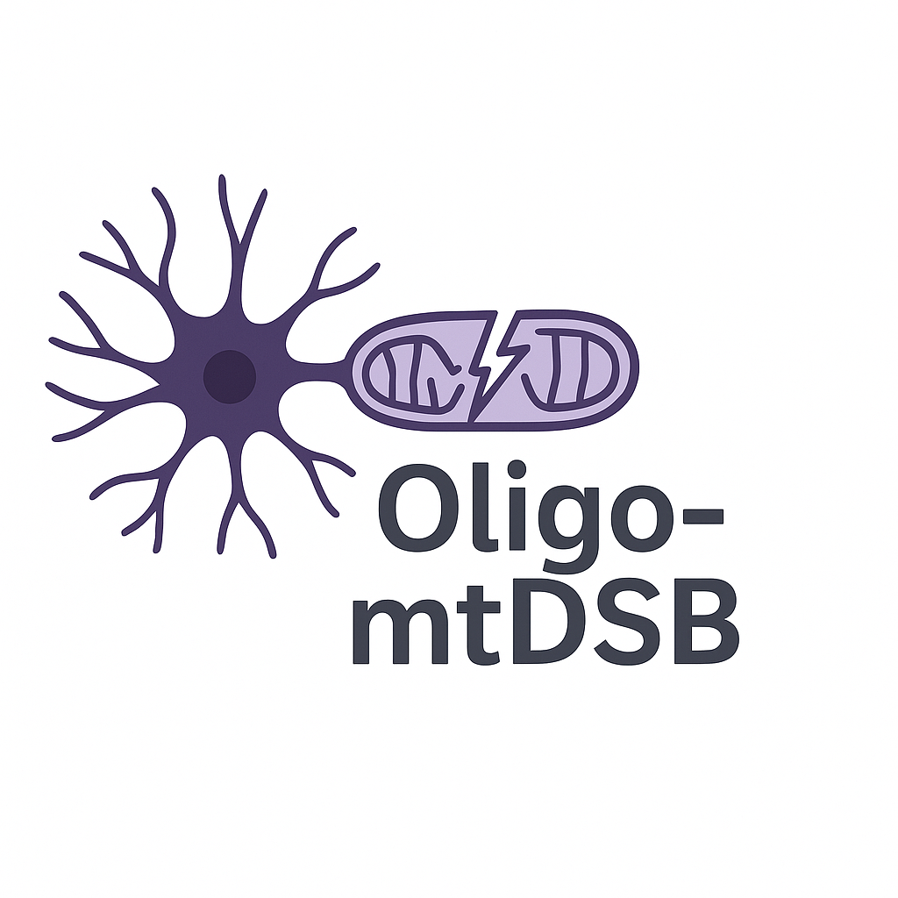

# oligo-mtDSB  

  

This project investigates the consequences of double-stranded breaks (DSBs) in mitochondrial DNA (mtDNA) of oligodendrocytes using a genetically engineered mouse model. Xenium is applied to capture cellular and regional responses to mtDNA damage in the CNS.  

## Link to original publication and thesis
Link: https://pmc.ncbi.nlm.nih.gov/articles/PMC5647772/ and https://scholarship.miami.edu/view/pdfCoverPage?instCode=01UOML_INST&filePid=13386228880002976&download=true

## Project Overview  
- **Model**: Mouse with induced mtDNA double-strand breaks in oligodendrocytes  
- **Focus**: Linking mitochondrial genome instability to oligodendrocyte dysfunction, demyelination, and lesion formation  
- **Data**: 10x Genomics Xenium (spatial transcriptomics)  
- **Goal**: Define how mtDNA integrity impacts oligodendrocyte biology and contributes to neuroinflammation and MS-like pathology  

## Repository Structure  
- `notebooks/` – analysis workflows (QC, clustering, differential expression, spatial mapping)  

## 🔄 Updates
1. 🧩 **Cluster annotation** completed at *leiden* resolution 2.  
2. 🗺️ **Anatomical compartments** have been defined and annotated.  
3. 📊 **Differentially expressed genes (DEGs)** identified across both **condition** and **time**.  

## Preliminary findings:🧬 Mitochondrial DNA Damage and Oligodendrocyte Stress Programs
In this project, we investigate how mitochondrial DNA double-strand breaks (mtDSBs) affect oligodendrocytes (OLs) and the surrounding microenvironment. Our analysis reveals that OLs exposed to mtDNA damage do not simply die, but instead activate a **coordinated multi-pathway stress response**:

- 🔥 **Oxidative stress defenses** — *Mt2, Gstp1, Sqstm1* and antioxidant transcriptional control (*Nfe2l1*).  
- ⚡ **Mitochondrial and ER stress signaling** — integrated stress response (ISR) and unfolded protein response (UPRmt) (*Atf4, Jun, Hspa5, Hspd1, Hspa9*).  
- 🛡️ **Antigen presentation pathways** — upregulation of MHC-I molecules (*B2m, H2-D1, H2-K1*) and antigen processing enzymes (*Ctss*), suggesting stressed OLs become visible to the immune system.  
- 🚚 **Transport and myelin support disruption** — altered kinesin/dynein motors (*Kif5a, Kif5b, Dync1li1*) and adhesion molecules (*Itgb1, Mpzl1*).  
- 🌟 **Reactivity and glial crosstalk** — induction of *Ndrg2*, *Gfap*, and calcium-binding proteins (*S100a1, Calb2*).  
- 📣 **Inflammatory mediators** — *Nmu* (neuromedin U) and *Ccl3*, pointing to signaling that may recruit and activate immune cells.

**✨ Overall, these findings show that mitochondrial genome instability in oligodendrocytes drives a “stressed but not dead” phenotype**, characterized by oxidative stress, antigen presentation, and glial–immune interactions. This creates a permissive environment for **immune activation and tissue remodeling**, providing a mechanistic link to multiple sclerosis (MS)-like pathology.

## 🧠 Region-independent effects (Oligodendrocytes)

### 21 weeks (early phase)
- **Overall pattern:** Mild transcriptional response dominated by early stress and differentiation shifts.  
- **Upregulated genes:** *Mt1*, *Trh*, *Nkx6-2*, *Cst7*, *Otp*  
- **Downregulated genes:** *Hoxa2*, *Hoxb3*, *Hoxb5*, *Col1a1*, *Bglap*, *Trim36*  

🧩 **Interpretation:**  
Early mtDNA damage elicits a subtle mitochondrial and oxidative stress response (*Mt1*), with downregulation of developmental/myelin structural programs. Suggests initial compensatory or remodeling phase before full ISR activation.

---

### 60 weeks (late phase)
- **Overall pattern:** Broad activation of the integrated stress response (ISR), mitochondrial UPR, and inflammatory signaling.  
- **Upregulated genes:** *Atf5*, *Trib3*, *Gfap*, *C4b*, *Cd40*, *Cst7*, *Gpnmb*, *Serpine1*, *Gdf15*  
- **Downregulated genes:** *Pmch*, *Hcrt*, *Cercam*  

🧩 **Interpretation:**  
At later stages, oligodendrocytes show a robust ISR/UPRmt profile (*Atf5*, *Trib3*, *Gdf15*) together with glial activation (*Gfap*, *Gpnmb*) and complement/inflammatory pathways (*C4b*, *Cd40*).  
This reflects a transition from **mitochondrial stress adaptation** to **chronic inflammatory signaling** and possible non-cell-autonomous effects on neighboring neurons.

---

## 🧬 Comparative summary of regional responses to mtDNA DSBs (Oligodendrocyte model)

| Category | **Hypothalamus** | **Thalamus** | **Pallidum + Corpus Callosum** |
|-----------|------------------|--------------|--------------------------------|
| **Neuronal (Hcrt / Pmch)** | 🔻 **Strong down** | 🔻 Mild | ⛔ None |
| **Stress (Atf5 / Trib3)** | 🔺 Moderate | 🔺 Strong | 🔺 Strong |
| **Complement / Inflammatory (C4b, Cst7, Cd74)** | 🔺 Strong | 🔺 Medium | 🔺 Medium |
| **Astro / Microglial activation (Gfap, Gpnmb)** | 🔺 Strong | 🔺 Medium | 🔺 Medium |
| **Metabolic adaptation (Gdf15, Adm)** | 🔺 Medium | 🔺 Medium | 🔺 Medium |
| **White-matter–specific response** | 🟠 Some | 🟠 Some | 🔴 Strong |

---

**Interpretation:**  
- The **hypothalamus** exhibits the most pronounced and multifaceted response — strong glial stress and inflammatory activation, accompanied by loss of neuropeptidergic markers (*Hcrt*, *Pmch*).  
- The **thalamus** shows a robust glial ISR/stress pattern but little neuronal involvement.  
- The **pallidum + corpus callosum** displays a predominantly **cell-intrinsic oligodendrocyte stress response** typical of white-matter regions.

---