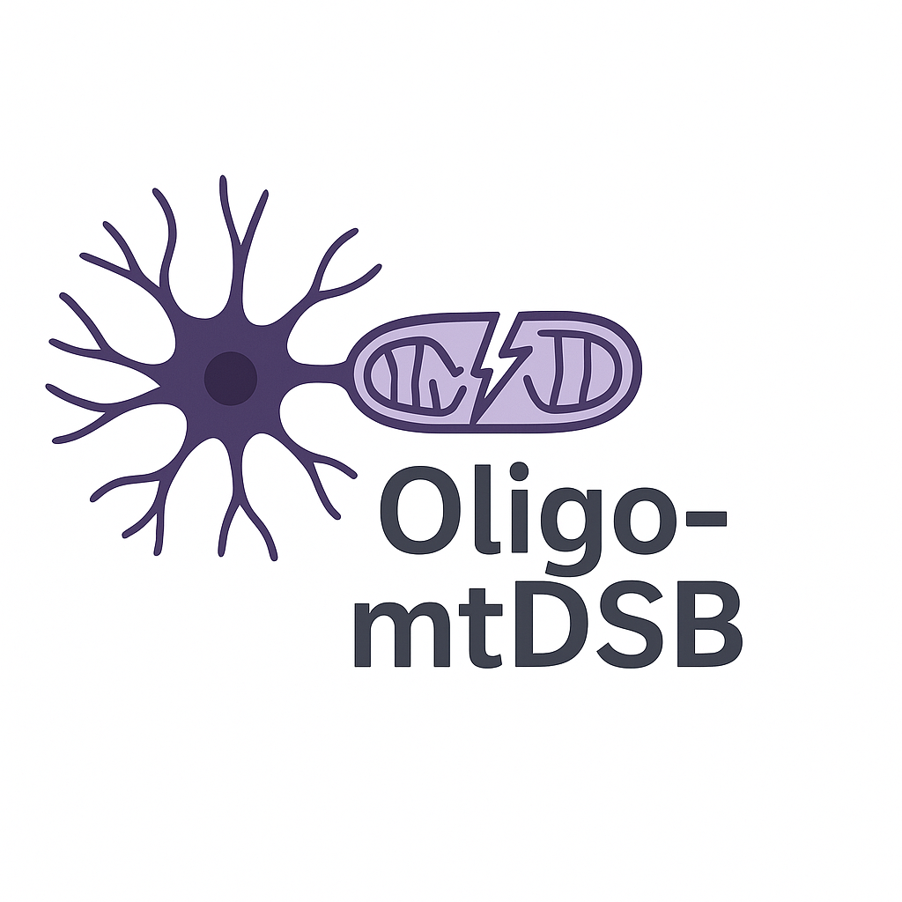

# oligo-mtDSB
<p align="center">
  
</p>

Consequences of double-stranded breaks (DSBs) in mitochondrial DNA (mtDNA) of oligodendrocytes, in a
genetically engineered mouse model, measured with 10x Xenium spatial transcriptomics of brain sections.

**Design.** 12 sections = 2 time points of DSB induction (`age` P21, P60) x 2 conditions
(`condition` control, mtDSB) x 3 sections. Cells carry a cell-type label (`cell_class`, 12 classes) and a
read-based anatomical compartment (`RBD_compartment_simplified`, 12 regions). The section is the
biological replicate in every test.

## Background references
- https://pmc.ncbi.nlm.nih.gov/articles/PMC5647772/
- https://scholarship.miami.edu/view/pdfCoverPage?instCode=01UOML_INST&filePid=13386228880002976&download=true

---

## Start here

| I want to ... | Go to |
|---|---|
| run the **region x time-point treatment comparison** on the full data | `scripts/run_region_time_de.py` (see below) |
| make / update the figures for that comparison | `notebooks-05/01-region-time-treatment-figures.ipynb` |
| understand the statistics | `utils/region_time_de.py` module docstring |
| check the pipeline works without the data | `python tests/test_region_time_de.py` (synthetic data, ~20 s) |
| read the manuscript draft | `results/paper/manuscript.md` (built from `results/paper/[0-9]*-*.md` by `build_manuscript.py`) |
| see how the current annotation / compartments were made | `notebooks-02/01`-`03`, `notebooks-02/13`, `notebooks-04/00` |

### Data location

The annotated h5ad files are **not in the repository**. They live on an external SSD (`/Volumes/processing2`,
exFAT) that is normally attached to the office Mac (reachable over Tailscale; hostname in your ssh config,
here called `<office-mac>`); the same path appears in the notebooks when that disk is plugged into
the laptop. Copying over Tailscale runs at ~2 MB/s (a 10 GB file takes ~1.5 h), so plug the disk in when possible.

```
/Volumes/processing2/oligo-mtDSB/data/
    mtDNA_DSB_5k_clustered_annotation_with_rbd_2_cytetype_brain_novae4.h5ad   <- current full file: 980 474 cells x 5 101 genes,
                                                                                 layers['counts'] raw, cell_class_updated, RBD, cytetype, novae (10.4 GB)
    mtDNA_DSB_5k_clustered_annotation_with_rbd_2_cytetype_brain_novae.h5ad    <- same without cell_class_updated
    mtDNA_DSB_5k_clustered_annotation_MANA.h5ad                                <- 250 highly-variable genes only (MANA embedding); NOT for DE
    mtDNA_DSB_5k_clustered_annotation_with_rbd_2.h5ad                          <- input of notebooks-02/09-12
    ... older intermediates (manual_annotation*, LLM_anno*, higher_res*, raw)
```

There is no `novae3` file on the disk even though `notebooks-04` writes one; `novae4` is the file to use.
`data/` in the repo only holds one raw section (`RB4282.h5ad`) and the Allen ABC atlas caches. The HTCondor
cluster (`monodmaster.ki.se`, `/date/gcb/gcb_CML/oligo-mtDSB`) was only used for the read-based compartments.

The office Mac has the same code copied into its checkout of this repo (untracked files, 2026-09-30); its
`cellcharter-env` has pydeseq2 0.5.4. Launch there with:

```bash
ssh <office-mac> 'cd ~/work/karolinska/development/oligo-mtDSB && nohup ~/miniconda3/envs/cellcharter-env/bin/python scripts/run_region_time_de.py --h5ad /Volumes/processing2/oligo-mtDSB/data/mtDNA_DSB_5k_clustered_annotation_with_rbd_2_cytetype_brain_novae4.h5ad --outdir results/region_time --layer counts --n-cpus 12 > logs/region_time_full.log 2>&1 &'
rsync -a <office-mac>:~/work/karolinska/development/oligo-mtDSB/results/region_time/ results/region_time/
```

### Environments

| conda env | use for | has |
|---|---|---|
| `karospace311` | DE pipeline, tests | scanpy 1.11, **pydeseq2 0.5.4**, statsmodels |
| `cellcharter` | spatial plotting, clustering notebooks (notebooks-04) | scanpy, squidpy, cellcharter, scvi-tools (no pydeseq2) |

No local env has pymc, pertpy or decoupler; the Bayesian notebooks (`notebooks-01/28-30`,
`notebooks-02/09-12`) ran under kernels (`sc`, `sc_py312`, `EUCLID_ENV`) that no longer exist here.

---

## Region x time-point comparison (current pipeline)

One maintained implementation replaces the copies of `pseudobulk_by` / `run_by_region` / `combine_delta`
that were pasted into `notebooks-01/25`, `notebooks-01/26` and `notebooks-02/04`.

```bash
conda activate karospace311
python scripts/run_region_time_de.py \
    --h5ad /Volumes/processing2/oligo-mtDSB/data/mtDNA_DSB_5k_clustered_annotation_with_rbd_2_cytetype_brain_novae4.h5ad \
    --outdir results/region_time --layer counts --n-cpus 8
# then open notebooks-05/01-region-time-treatment-figures.ipynb
```

Only the obs columns and the counts layer are read from the file, so the 10 GB h5ad needs ~3 GB of RAM.
The full run (980 474 cells, 5 101 genes, 14 classes) took 27 min with 12 CPUs on the office Mac; the 250-gene MANA file takes 2 min on a laptop.
`results/region_time_MANA250/` holds that 250-gene run (real data, all cell types) as a worked example
of every output table and figure, but it lacks *Gdf15*, *Atf5*, *Trib3* and most of the panel.

If the h5ad keeps raw counts in `.X` instead of a `counts` layer, pass `--layer X`. Use `--cell-types` /
`--regions` to restrict, `--no-interaction` / `--no-region-vs-rest` to skip the slower tests.

**What it computes** (`utils/region_time_de.py`), all on section-level pseudobulk (summed raw counts per
cell type x region x section, sections with < 20 cells of that type in that region dropped and logged):

| output in `results/region_time/` | question | method |
|---|---|---|
| `de_condition_by_region_age.csv` | mtDSB vs control **within** each (cell type, region, age) | pyDESeq2 Wald, one model per stratum, >= 2 sections per condition |
| `de_age_contrast_by_region.csv` | is the treatment effect different at P60 vs P21 in this region? | z-test on log2FC(P60) − log2FC(P21) from the table above |
| `de_interaction_by_region.csv` | same question, one joint model per (cell type, region) | pyDESeq2 `~ age + condition + age:condition`; `term = age_x_condition` (also `condition_at_21`, `condition_at_60`) |
| `de_region_vs_rest.csv` | is the effect in this region different from the rest of the tissue? | mtDSB vs control on the complementary pseudobulk, then z-test on the difference |
| `summary_by_region_age.csv` | hits per stratum (padj < 0.05, abs log2FC >= 0.5, baseMean >= 20), activation index, top genes | |
| `*_log.csv`, `run_info.json`, `pseudobulk_*.csv` | which strata were skipped and why, parameters, the pseudobulk itself | |

The region label `All regions` is the whole-section pseudobulk per cell type (region-independent effect).
All tables share the columns `cell_type, region, age, gene, baseMean, log2FC, lfcSE, stat, pvalue, padj`.

**Figures** (`utils/region_time_plots.py`, driven by `notebooks-05/01`): hit-count overview per cell type
(regions x age), P21-vs-P60 log2FC scatter per region, gene x (region @ age) heatmaps, interaction
lollipops, region-vs-rest scatter, volcanoes. The notebook also writes `summary_table.md`,
`interaction_hits.csv` and `region_specific_hits.csv` for the manuscript.

---

## Repository structure

```
notebooks-01/   first pass (old 5-glia annotation, `compartment` regions)      LEGACY
notebooks-02/   current annotation (cell_class x RBD_compartment_simplified)   CURRENT for annotation, compartments, Bayesian track
notebooks-03/   nuclei-segmented data exploration, scCellFie                   side project
notebooks-04/   inspection / OL sub-clustering on the novae3 h5ad              CURRENT (in progress)
notebooks-05/   region x time-point treatment comparison figures               CURRENT
scripts/        run_region_time_de.py - batch run of the DE pipeline
tests/          synthetic end-to-end test of utils/region_time_de
utils/          region_time_de.py, region_time_plots.py, spatial_utils.py      maintained
                de_analysis_utils.py, io_utils.py, misc_utils.py,
                plotting_utils.py, qc_utils.py                                  auto-harvested from notebooks by utils_builder.ipynb; duplicated
                                                                                functions, missing imports; reference only
                run_compartment_read_based.{py,sh,sub}                          cluster job for read-based domains (logs in logs/)
results/        see the map below
results/paper/  manuscript sections + build_manuscript.py
assets/         logo, figure, markers_mouse_xenium.csv (marker list input)
data/           local inputs only (gitignored)
logs/           cluster logs of run_compartment_read_based
```

### Results map: which notebook produced what

| folder | produced by | annotation | content | status |
|---|---|---|---|---|
| `results/region_time/` | `scripts/run_region_time_de.py` (run 2026-09-30 on the office Mac, `novae4`, 27 min) + `notebooks-05/01` | `cell_class` x RBD | condition x region x age DE, 14 cell classes, 5 101 genes, 197/336 strata testable | **current** |
| `results/region_time_cell_class_updated/` | `utils.region_time_de.merge_cell_types` on the pseudobulk above | Immature OL I-IV merged | same tests for the merged "Immature Oligodendrocytes" class only | current |
| `results/region_time_MANA250/` | same, on the 250-gene MANA file | cell_class x RBD | worked example on real data; 181/264 strata testable | example only |
| `results/age/` | `notebooks-01/25` | old 5 glia | mtDSB vs control per age (whole tissue) + `deltaLFC_60_vs_21.csv` (0 genes with q < 0.05 in any type) | legacy |
| `results/region/` | `notebooks-01/26` | old 5 glia, 14 old compartments | mtDSB vs control per region x age, OL and OPC only | legacy |
| `results/age_region/` | none (orphan) | as above | byte-for-byte duplicate of `results/region/` up to float noise | can be deleted |
| `results/figures/region_fingerprints_by_age/` | `notebooks-02/04` | cell_class x RBD | activation-index PNGs; the underlying DESeq2 tables were never saved | superseded by `region_time` |
| `results/bayes/` | `notebooks-01/29` | old 5 glia | PyMC pseudobulk models on shortlisted genes | legacy |
| `results/casecontrol_hvg_results_live_condition/`, `baysian_diff_condition.csv` | `notebooks-02/09` | cell_class | NumPyro hierarchical case-control, ages pooled, no region | incomplete gene set |
| `results/casecontrol_by_age_results_2/` | `notebooks-02/11-*` (compared in `12`) | cell_class | same model per age; 495 genes at P21, 181 at P60 of 5101 | incomplete |
| `results/cell_types*`, `compartments_all/`, `rbd_highlight_plots_0.5/` | `notebooks-02/32-34`, `03` | cell_class / RBD | spatial highlight PNGs and GIFs | figures |
| `results/figures/`, `figures_dark*/` | various | mixed | `<CellType>_21w_vs_60w.*` from `notebooks-01/25`, dotplots, UMAPs | figures |

### Reading the `results/region_time/` tables: two caveats

- **Neuropeptide spill-over.** *Hcrt*, *Pmch*, *Sst*, *Pdyn* appear as the strongest "glial" hits and
  age x condition interactions in the hypothalamus (log2FC down to -11) for oligodendrocytes, astrocytes and
  microglia. These are neuronal transcripts picked up by neighbouring segmented cells; they report loss of
  hypothalamic neuropeptide expression in mtDSB sections, not a glial programme. Filter them (or any neuronal
  marker) before interpreting glial regional hits.
- **Neural Stem Cells @ Ventricular system @ P60** has 671 significant genes (411 up / 461 down) with
  tanycyte / ependymal markers (*Gpr50*, *Col23a1*, *Crym*) at log2FC -8. That is a change in what the
  "Neural Stem Cells" class contains between control and mtDSB sections at P60 (section plane / third
  ventricle coverage), not 671 regulated genes. Check `pseudobulk_meta.csv` cell numbers and the spatial
  plots before using it.
- In `novae4.h5ad`, `cell_class` still splits immature oligodendrocytes into I-III (IV is too rare and gets
  dropped); the merged label is `cell_class_updated`. Re-run with `--cell-type-key cell_class_updated` for a
  clean merged analysis, or use `results/region_time_cell_class_updated/` (merged from the pseudobulk).

### Known issues in legacy notebooks (kept for the record, not fixed there)

- `notebooks-02/04-region-DGE.ipynb` defines `run_by_region` three times; the executed copy drops the
  region-vs-region test. Cell 56 asks for `"Mature oligodendrocytes"`, a label that no longer exists, so
  the oligodendrocyte P21-vs-P60 contrast silently produced nothing. Summaries there use raw p-values.
- `notebooks-01/26` references an undefined `gene_panel`; `notebooks-02/12` compares two incomplete gene sets.
- Bayesian notebooks fit a Gaussian model with fixed noise to integer counts and ignore region.
- The manuscript sections 3 and 6 name genes and regions (e.g. Trh, fiber tracts, cortical regions) that
  the saved legacy tables do not support at padj < 0.05; re-derive those statements from `results/region_time/`.

---

## Analysis history

1. Cluster annotation at leiden resolution 2, refined with cytetype (`notebooks-02/13`) and manual merging (`notebooks-04/00`).
2. Read-based anatomical compartments (`utils/run_compartment_read_based.py`, `notebooks-02/03`).
3. DEGs across condition and time, whole tissue (`notebooks-01/25`) and per region (`notebooks-01/26`, `notebooks-02/04`).
4. Hierarchical Bayesian case-control models (`notebooks-02/09-12`).
5. 2026-09: consolidated region x time-point pipeline (`utils/region_time_de.py`, `notebooks-05`).

## Preliminary findings (from the legacy analyses; to be re-checked with `results/region_time/`)

Oligodendrocytes exposed to mtDNA damage activate a coordinated stress and communication program rather
than simply dying: oxidative-stress defences (*Mt1/Mt2*, *Gstp1*, *Sqstm1*), integrated stress response and
UPRmt (*Atf4*, *Atf5*, *Trib3*, *Cdkn1a*, *Hspa5*), a mitokine-like secretome (*Gdf15*, *Adm*, *Cst7*,
*Igfbp3*, *Serpina3n*), antigen presentation (*B2m*, *H2-D1*, *H2-K1*, *Cd74*) and complement (*C4b*).
The response is stronger after P60 induction than after P21 induction, and regionally the hypothalamus
(with loss of *Hcrt* and *Pmch*) and thalamus show the largest glial responses, while
pallidum / corpus callosum shows a more cell-intrinsic white-matter pattern. Details:
`results/paper/3-agexcondition-glia.md`, `results/paper/6-regional-activation-fingerprint.md`.

Caveat: in the saved legacy tables *Gdf15* has log2FC 4.7 but padj 0.13 in mature oligodendrocytes at
P60, and no gene reaches q < 0.05 in the whole-tissue age-difference test, so the "progressive" claims rest
on descriptive comparisons. The interaction test in the new pipeline is the formal version of that claim.
