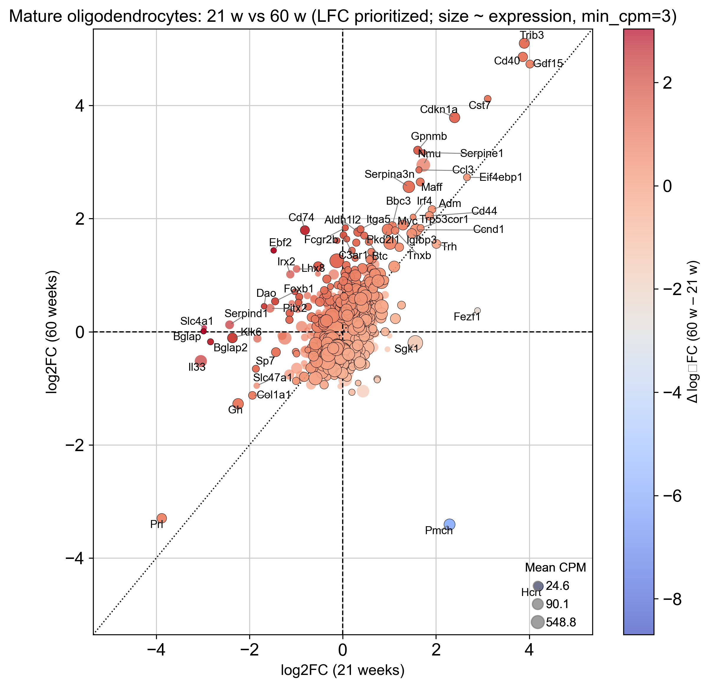
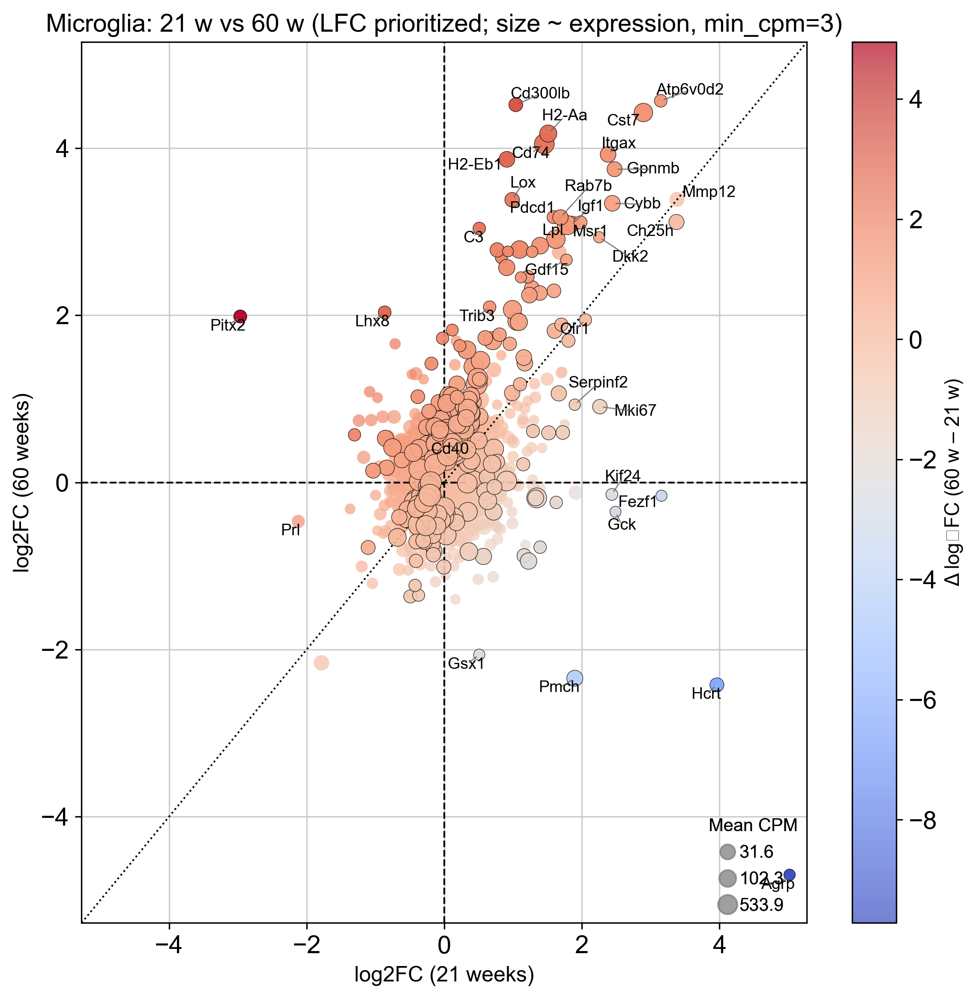
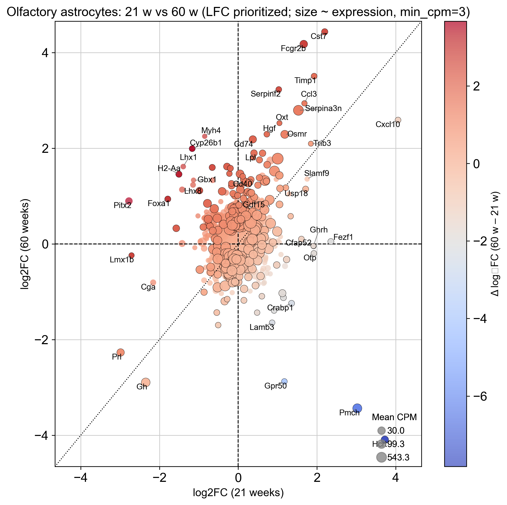
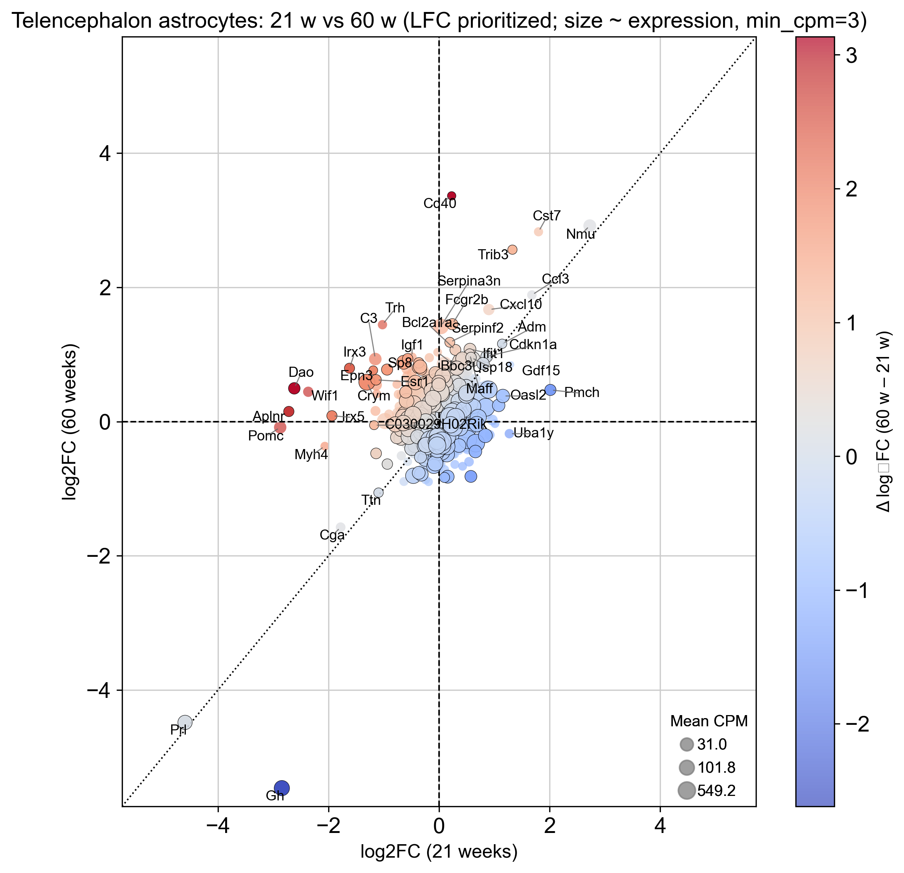
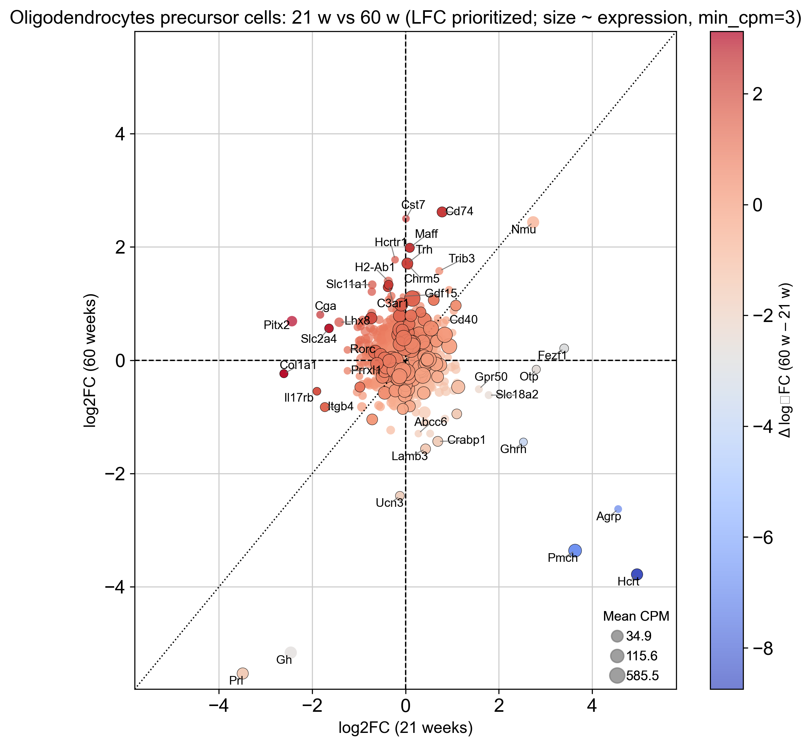

# 3. Differential gene expression reveals cell type–specific changes in integrated stress response, cytokine and inflammatory signaling, and metabolic/mitochondrial reprogramming

To assess how mitochondrial DNA double-strand breaks (mtDSBs) in oligodendrocytes affect glial populations over time, we compared differential expression profiles between 21- and 60-day-old mice across mature oligodendrocytes, oligodendrocyte precursor cells (OPCs), astrocytes (olfactory and telencephalic), and microglia.

Across all glial populations, mtDSB induction resulted in transcriptional changes consistent with cell-intrinsic stress adaptation and immune/metabolic reprogramming. However, the magnitude and breadth of these changes varied markedly among cell types. Mature oligodendrocytes, microglia, and olfactory astrocytes exhibited the most pronounced remodeling, as evidenced by the wide distribution of log₂ fold changes at both ages. In contrast, telencephalon astrocytes and OPCs showed more modest transcriptional shifts, reflecting either regional protection or lineage-specific resilience to oligodendrocyte mitochondrial dysfunction.

In mature oligodendrocytes, we observed a strong age-dependent amplification of mitochondrial stress–related programs, with upregulation of *Trib3*, *Gdf15*, *Cd40*, *Cst7*, and *Gpnmb* at 60 days. These patterns indicate a transition from acute stress signaling to a chronic integrated stress response (ISR) coupled to immune activation. Microglia mirrored this pattern, with pronounced increases in *Cd74*, *C3*, *Cst7*, *Cybb*, and *H2-Eb1*, suggesting heightened antigen presentation and lysosomal remodeling consistent with disease-associated microglial (DAM)-like states.

  

Astrocytes displayed region-specific adaptations. Olfactory astrocytes exhibited broad transcriptional activation, sharing ISR and immune signatures with oligodendrocytes (e.g., *Trib3*, *Serpina3n*, *Cd40*, and *Gdf15*), whereas telencephalon astrocytes showed a more restricted response dominated by modest ISR activation and limited inflammatory engagement. OPCs displayed comparatively constrained transcriptional remodeling, with subtle induction of *Gdf15*, *Cd40*, and *Trib3*, suggesting partial engagement of mitochondrial stress signaling without a full reactive transition.

  
  

Overall, these analyses reveal that mature oligodendrocytes and microglia undergo the strongest age-dependent transcriptional reprogramming in response to mtDNA damage, while astrocytic and precursor populations show graded and region-specific sensitivity. The extent of transcriptional spread thus captures both the intensity and chronicity of mitochondrial stress adaptation across the glial landscape.

---

# 4. Mitochondrial stress induces a mitokine-like secretome in mature oligodendrocytes

Given the broad and cell type–specific transcriptional remodeling observed in the differential expression analysis, we next sought to identify molecular programs in oligodendrocytes that could mediate or propagate these signals to the surrounding glia. The strong induction of stress-responsive and secreted genes at 60 days suggested the emergence of a *mitokine-like secretome*—a transcriptional signature reflecting mitochondrial distress communication.

Analysis of gene expression changes in mature oligodendrocytes following mtDNA double-strand breaks revealed activation of a broad mitochondrial stress response encompassing both intracellular adaptive signaling and secreted stress mediators. Among the most strongly upregulated transcripts were the canonical mitokine *Gdf15* and the vasoactive peptide *Adm* (adrenomedullin)—both known markers of the mitochondrial integrated stress response (ISR^mt) and key mediators of intercellular communication during metabolic distress.

Additional stress-linked genes such as *Cst7*, *Igfbp3*, and *Serpina3n* (the latter also upregulated in astrocytes and microglia) suggest that oligodendrocytes adopt a secretory phenotype resembling a glial mitokine program. These secreted factors are likely to act in a paracrine fashion, signaling metabolic imbalance and influencing neighboring glia and immune cells.

Concurrently, induction of *Cdkn1a* (*p21*), *Maff*, and *Eif4ebp1* points to activation of the ATF4–CHOP–dependent ISR and translational control mechanisms characteristic of mitochondrial dysfunction. The upregulation of *Aldh1l2*, a mitochondrial folate enzyme maintaining NADPH and redox balance, further supports a coordinated redox and proteostasis response.

Taken together, these findings indicate that mtDNA damage in oligodendrocytes not only triggers cell-intrinsic ISR^mt pathways but also promotes secretion of mitokine-like molecules capable of propagating mitochondrial stress signals to surrounding glial populations. This may underlie the widespread transcriptional reprogramming observed in microglia and astrocytes at later time points, linking localized oligodendrocyte mitochondrial distress to non–cell-autonomous glial activation across the CNS.

