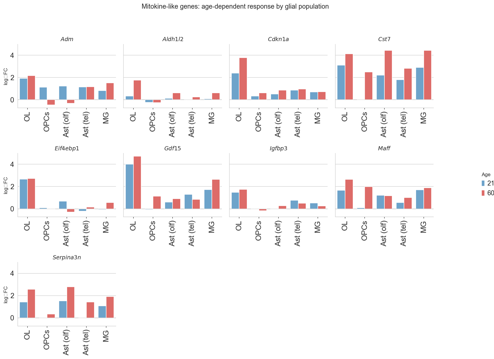

# Mitochondrial stress induces a mitokine-like secretome in mature oligodendrocytes
Analysis of gene expression changes in mature oligodendrocytes following mtDNA double-strand breaks revealed activation of a broad mitochondrial stress response encompassing both intracellular adaptive signaling and secreted stress mediators. Among the most strongly upregulated transcripts were the canonical mitokine Gdf15 and the vasoactive peptide Adm (adrenomedullin)—both known markers of the mitochondrial integrated stress response (ISR^mt) and key mediators of intercellular communication during metabolic distress.

Additional stress-linked genes such as Cst7, Igfbp3, and Serpina3n (the latter also upregulated in astrocytes and microglia) suggest that oligodendrocytes adopt a secretory phenotype resembling a glial mitokine program. These secreted factors are likely to act in a paracrine fashion, signaling metabolic imbalance and influencing neighboring glia and immune cells.

Concurrently, induction of Cdkn1a (p21), Maff, and Eif4ebp1 points to activation of the ATF4-CHOP–dependent ISR and translational control mechanisms characteristic of mitochondrial dysfunction. The upregulation of Aldh1l2, a mitochondrial folate enzyme maintaining NADPH and redox balance, further supports a coordinated redox and proteostasis response.

Taken together, these findings indicate that mtDNA damage in oligodendrocytes not only triggers cell-intrinsic ISR^mt pathways but also promotes secretion of mitokine-like molecules capable of propagating mitochondrial stress signals to surrounding glial populations. This may underlie the widespread transcriptional reprogramming observed in microglia and astrocytes at later time points, linking localized oligodendrocyte mitochondrial distress to non–cell-autonomous glial activation across the CNS

